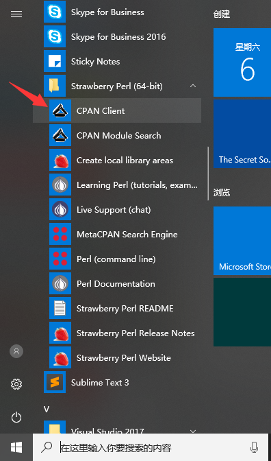

# ROUGE-1.5.5 for windows

ROUGE是Summarization领域最常用的评价指标，本文档讲解在Win10下安装使用ROUGE1.5.5工具包

## 安装
### 需要下载的工具：

* [ROUGE-1.5.5](https://pan.baidu.com/s/1B7-LYn1lZKC8f51yXxNK9w)
* [Strawberry Perl](http://strawberryperl.com/)

### 安装步骤：

1. 进入Strawberry Perl官网，直接选择Recommended version下载即可，下载直接进行安装。

2. 安装好Strawberry Perl后，找到并运行CPAN Client组件，在CPAN Client组件中输入install XML::DOM，回车，等待安装。

3. 下载的ROUGE-1.5.5，解压，将'path\to\RELEASE-1.5.5'和'path\to\RELEASE-1.5.5\data'添加到系统环境变量Path中。

4. 在RELEASE-1.5.5目录下，分别运行ROUGE-1.5.5.pl脚本和runRouge-test.pl脚本，输出如下结果则安装成功：

## 使用

